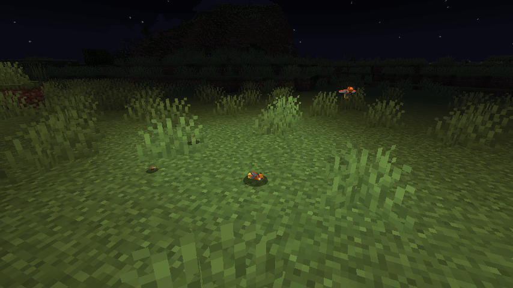

# 🐾 Player Companion's (1.20)

Player Companions adds additional creatures which will follow, protect or help you.

## ✨ Features

- Persistent Player companions with dedicated item to easy spawn and despawn.
- Different player companion types like collector, follower, guard, healer and supporter.
- Different sub-types, styles and colors.
- Friendly fire option (for all of your tamed companions).
- Advanced control and experience level system.
- Jade / Hwyla plugin integration.
- Custom skins for specific player companions.
- Adjustable custom names.
- Automatic data backup.

## Player Companion Types

There are different types of companions which unique abilities.

### Collector

The collector collects automatic items in a specific radius in his own inventory.
You can access the inventory like a normal chest.

### Companion (wip)

The companion is a combination of the collector, follower and guard and has some additional features
like text lines.

### Follower

Is more like a cosmetic mob which will follow you around the world.

### Guard

The guard will protected you from hostile mobs and will attack any target you are attacking.
Equip your guard with weapons and armor to deal more damage and to have a better protection.

### Healer

The healer companion heals any player and your own companions in a specific radius.
Additional healer will stack up the effect, so if you are traveling with your friends it good to
have 1-2 healers in the group.

### Supporter

The supporter companions gives buffs to any player and your own companions in a specific radius.
Additional supporter will not stack up, but they will be able to buff the whole group.

## Spawn

The player companions are automatically spawned in specific biomes, but could be also spawned over
the specific items in the creative mode.

## Tame Items

Tame items are needed to tame the different kind of companions.
Each player companion prefer a specific tame item, in most cases you need several tame items to tame
a player companion.

## Controls

Most of the companions could be controlled with the following controls:

- **ALT + Right Click** (on Player Companion with empty Hand or Weapon) Change Aggressive status
  like passive, neutral, aggressive
- **CTRL + Right Click** (on Player Companion with empty Hand or Weapon) Order to sit / un-order to
  sit
- **Right Click** (on Collector with empty hand or normal Block) Open the companion inventory
- **Right Click** (on Player Companion with empty hand or normal Block) Open the companion menu
- **Right Click** (with Player Companion Item on Companion) Despawn/Spawn the companion
- **Right Click** (with Player Companion Item on empty place) Order to position
- **SHIFT + Right Click** (with empty hand) Pet the companion

### Order to a specific position

Click with the corresponding item on the desired position and your companion will move or teleport
to this position.

### Spawn / Respawn Companion

With the corresponding item, you can spawn / respawn your companion at any time with just a simple
click on an empty space.

### Despawn Companion

With the corresponding item, you can de-spawn your companion at any time. Just click with the right
item on the spawned companion.

## Compatible Mods

Most of the should be supported out of the box, but this is a list of mods which I personally tested
and working fine with this mod:

- ✅ [Guard Villagers][guard-villagers]
- ✅ [Human Companions][human_companions]
- ✅ [MoreVanillaArmor][morevanillaarmor]
- ✅ [Scaling Health][scaling-health]

Note: If the mod is not listed here, you need to test it on your own, if it works as expected.
I'm not able to test all different kind of mod combinations or mod packs.

## Type of Companions

There are different kind of companions which have different abilities and are living in different
biomes.
You can find a list of all companions and their corresponding tame items below.

### Dobutsu

The Dobutsu is a quick-change artist and can mimic the appearance of other players, even if their
form will remain the same.
Open the menu of a captured Dobutsu and click on **Texture Settings** to adjust the skin and the
Dobutsu will try to mimic the player.

They live in the open fields and like eating sweet berries.

### Fairies

The fairy is magical create and has different kind of abilities.
They will heal you and your group along your journey but will also learn new abilities from time to
time.

They live in the flower forest and like eating cakes and cookies.

### Fireflies

The Firefly will light up your path even in dark places.
There are easily to see during the night and will join you as long you take care of them.

They live in the plains and swamps and like eating honycombs.

### Lizards

The lizard will follow you along your journey.
They have no specific abilities, but are an easy to handle player companion.

They live in the desert, jungle, swamp and badlands and like eating eggs and berries.

### Pigs

The Pig is a great companion and will help you by carrying your stuff in their bags.
They will also collect dropped items to make sure you are not missing any loot during your journey.

They live in the plains and like eating carrots, potato and beetroot.

### Raptor

The Raptor is looking dangerous and he is, if he is hungry.

They live in jungle and like eating meat.

### Rooster

The Rooster is not looking dangerous, but it will give his live to protect you.
It could also carry a weapon like a sword to deal additional damage.

They live in plains and like eating wheat seeds.

### Samurai

The Samurai is a loyal player companion and will protect you from any harm by others.
They could carry different types of weapons and armor and will get stronger over the time.

They live in the mountains and like eating healthy apples.

### Small Ghasts

Small Ghast are not easy to catch, but once you became friend with one he will protect you for the
rest of his live.
They will shoot small fireballs to your targets and some hostile mob as well.

They live in the nether / nether wastes and like eating fresh bones.

### Small Slimes

Small Slime will follow you along your journey.
They have no specific abilities, but are an easy to handle player companion.

They live in jungles / swamps and like eating apples.

### Snails

Snail are slow, but they will pickup any items in their range to store them in their inventory.
To access their inventory, just click with our empty hand on them.

They live at the beach and like eating sea grass.

### Welsh Corgis

Welsh Corgi are will support you and other companions and players with their present and additional
effects.
Depending on the level they will give different kind of effects to the player.

They live in the taiga and like eating bones like any other dogs.

## 🙋FAQ

### I lost my companion item, is there are way to get it back❓

The easiest way is to get the identical (same type/variant) Player Companion Item (over creative
mode or `/give command`) and just clicking on the corresponding player companion to link it.
Please keep in mind that only the owner is able to link a player companion to an item.

### I lost my companion, is there are way to summon it❓

The easiest way is to use your Player Companion Item or alternative over
the `/player_companions summon` command.

## Version Status Overview 🛠️

| Version        | Status                |
|----------------|-----------------------|
| Fabric Version | ❌ Not planned         |
| Forge 1.16.5   | ❌ Not planned         |
| Forge 1.17.1   | ❌ Not planned         |
| Forge 1.18.1   | ⚠️ Deprecated         |
| Forge 1.18.2   | ⚠️ Maintenance only   |
| Forge 1.19     | ⚠️ Deprecated         |
| Forge 1.19.1   | ⚠️ Deprecated         |
| Forge 1.19.2   | ✔️ Active development |

## License

The MIT [LICENSE.md](LICENSE.md) applies only to the code in this repository. Images, models and
other assets are explicitly excluded.

## Note

Please only download the mod from the official CurseForge page or with the official CurseForge
launcher like:

🚀 <https://www.curseforge.com/minecraft/mc-mods/player-companions>

If you are downloading this mod from other sources we could not make sure that it works as expected
or does not includes any unwanted modification (e.g. adware, malware, ...).

[guard-villagers]: https://www.curseforge.com/minecraft/mc-mods/guard-villagers

[human_companions]: https://www.curseforge.com/minecraft/mc-mods/human-companions

[morevanillaarmor]: https://www.curseforge.com/minecraft/mc-mods/morevanillaarmor

[scaling-health]: https://www.curseforge.com/minecraft/mc-mods/scaling-health
